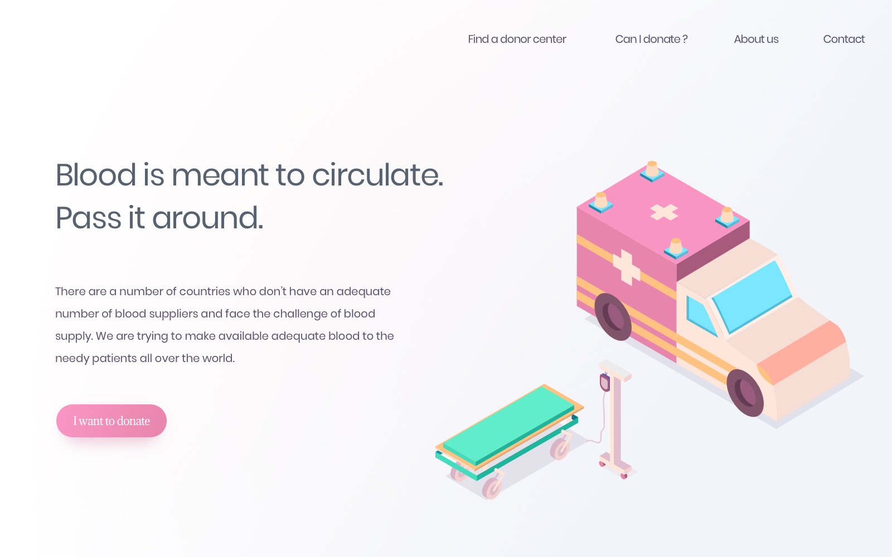

# Frontend Mentor - Blood Donation Landing Page Challenge

Design by: [Clément Marie](http://clement-marie.fr/)

Welcome! Thanks for checking out this front-end coding challenge. 

The challenge was to build out the project to the design inside the `/design` folder.

View my version of the landing page [here](https://dromo77.github.io/frontend-mentor-blood-donation-landing-page/).

## Styleguide

### Gradients
- Body background: `linear rgba(255,255,255,0.03) to rgba(184,201,229,0.25) at 165 degrees`
- Body background: `radial circle rgba(238,184,189,0.25) to rgba(255,255,255,0.25) at 75% from left and 75% from top`
- Call-to-action: `rgb(249,149,194) to rgb(232,133,173)`

### Shades
- Dark (for body copy): `rgb(86,98,112)` 

### Typography
#### Font Family
- [Poppins](https://fonts.google.com/specimen/Poppins)
- [Adamina](https://fonts.google.com/specimen/Adamina)

#### Font Weights
- 400
